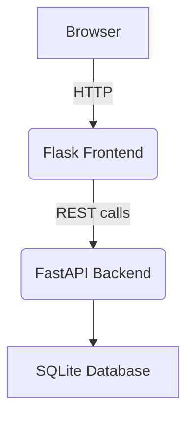
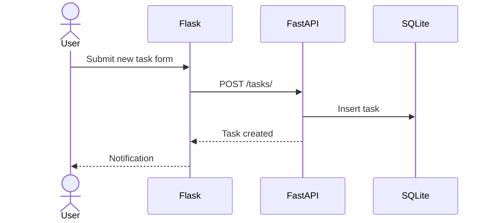

# Cyberpunk Task Board

## Project Overview
Cyberpunk Task Board is a minimal example application combining a **FastAPI** backend with a **Flask** front‑end. It demonstrates authentication with JWT, basic task management and a simple cyberpunk themed UI built with TailwindCSS. The project aims to be a reference for developers who want to understand how to integrate FastAPI services with a separate Flask user interface and deploy everything using Docker Compose.

## Features
- User registration and login with JWT authentication
- SQLite database handled by SQLAlchemy ORM
- CRUD API for tasks
- Flask UI consuming the REST API via JavaScript
- Dockerfiles and Docker Compose configuration
- Pytest suite covering API and front‑end routes

## Technology Stack
| Technology | Role |
|------------|------|
| **Python 3.11** | Programming language used throughout the project |
| **FastAPI** | Backend framework providing REST endpoints |
| **Flask** | Front‑end framework serving HTML templates and static files |
| **SQLAlchemy + SQLite** | ORM and lightweight database to persist users and tasks |
| **Pydantic** | Data validation and serialization layer |
| **Passlib & python-jose** | Password hashing and JWT token creation |
| **TailwindCSS** | Styling for the cyberpunk interface |
| **Docker & Docker Compose** | Containerization and orchestration of the services |
| **Pytest** | Test framework for unit and integration tests |

## Architecture & Folder Structure

```
.
├── app/                 # FastAPI backend
│   ├── core/           # Security utilities
│   ├── models/         # SQLAlchemy models
│   ├── routers/        # API endpoints
│   ├── schemas/        # Pydantic schemas
│   └── services/       # Business logic
├── frontend/            # Flask front-end
│   ├── routes/         # Blueprints
│   ├── static/         # CSS/JS assets
│   └── templates/      # Jinja2 templates
├── tests/               # Pytest suites
├── Dockerfile.fastapi   # Image for the API service
├── Dockerfile.flask     # Image for the front-end service
├── docker-compose.yml   # Multi-container definition
└── requirements.txt     # Python dependencies
```

### Component Diagram


## Endpoints (API Reference)
| Method | Path | Description |
|--------|------|-------------|
| **GET** | `/` | Health check |
| **POST** | `/register` | Create new user |
| **POST** | `/token` | Obtain JWT token |
| **GET** | `/items/me` | Retrieve current user information |
| **GET** | `/tasks/` | List all tasks |
| **POST** | `/tasks/` | Create a new task |
| **DELETE** | `/tasks/{task_id}` | Delete a task |

## Setup & Installation

### Local Development
1. Install Python 3.11 and `pip`.
2. Create a virtual environment and install requirements:
   ```bash
   python3 -m venv venv
   source venv/bin/activate
   pip install -r requirements.txt
   ```
3. Start the FastAPI server:
   ```bash
   uvicorn app.main:app --reload
   ```
4. In another terminal, start the Flask server:
   ```bash
   export FASTAPI_URL=http://localhost:8000
   python -m frontend.app
   ```

### Docker
1. Build the images and start the stack:
   ```bash
   docker compose up --build
   ```
   The API will be available on `http://localhost:8000` and the front‑end on `http://localhost:5000`.
2. Stop the containers with:
   ```bash
   docker compose down
   ```

Environment variable **`FASTAPI_URL`** is used by the Flask app to know where the API is reachable. Docker Compose sets this automatically.

## Running the Project
- Execute tests with coverage:
  ```bash
  pytest --cov
  ```
- Build the API Docker image manually:
  ```bash
  docker build -t cyberpunk-api -f Dockerfile.fastapi .
  ```
- Run the Flask front‑end standalone:
  ```bash
  FASTAPI_URL=http://localhost:8000 python -m frontend.app
  ```

## Screenshots or Diagrams
Below is a simplified flow of a user creating a task.


## Contributing
1. Fork the repository and create your feature branch.
2. Commit your changes and open a pull request against `main`.
3. Ensure `pytest` passes before submitting the PR.
4. Describe your changes clearly in the PR description.

## License & Credits
This project is released under the MIT License. Original authorship by Yeray Alonso Reyes.
